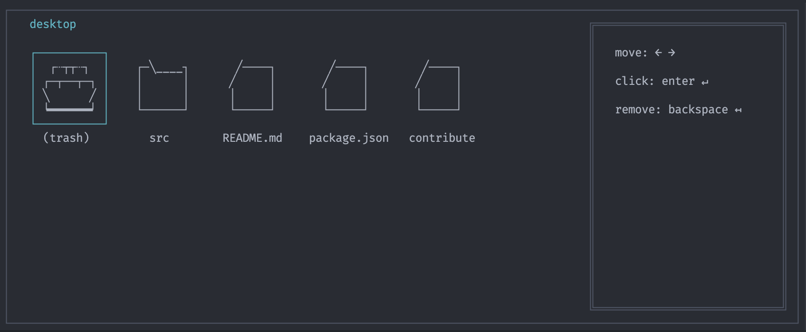
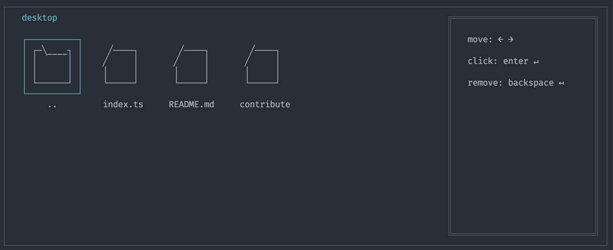
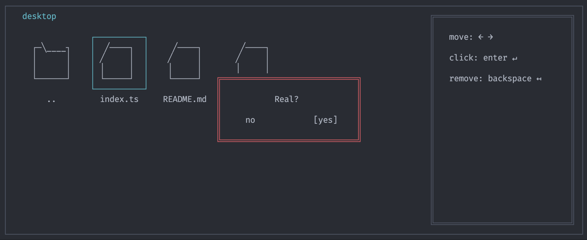

## ❤️‍🔥 CLI를 좋아하는 당신에게, donstop.

> Don't Stop! Donstop! Don't Stop! Donstop! Don't Stop! Donstop! Don't Stop! Donstop! Don't Stop! Donstop!

### 스크린샷





### 주제

CLI 환경에서 구현된 시스템 운영체제 (운영체제 아님)

### 만든 목적

CLI를 좋아하다 못해 사랑하는 분들을 위해,<br />
뭔가 이런게 있으면 재미있지 않을까 싶어서 만들어 봤어요.

### 방향성

부자되기 히히

### 기획

- 바탕화면, 폴더 및 파일 구조, 휴지통, 시스템 설정 같은 기초적인 것만 구현

### 🎙️ 설치 방법

```bash
$ npm install -g donstop
```

### 📸 실행 방법

```bash
donstop boot
```
